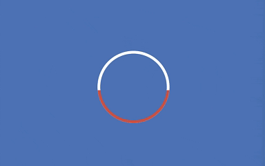
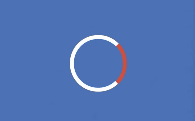
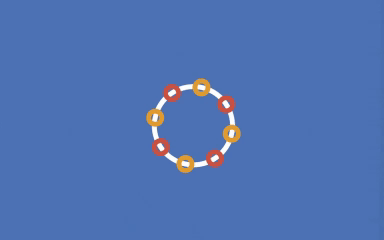

# Micro Loaders

[](https://github.com/MicroClub-USTHB/flutter_loaders/actions/workflows/main.yml)

A collection of animated loaders with flutter made by [Micro Club - USTHB](https://github.com/MicroClub-USTHB).

## What is Micro Club ?

Micro Club is a scientific club established in 1985 at USTHB. It is the first Algerian scientific club dedicated to computer science and technology, with over 1000 members passionate about technology and collaboration. MicroClub fosters scientific innovation and nurtures young talents in the field of technology through various activities, events, and projects.

## Installing

```yaml
dependencies:
  micro_loaders: ^0.0.1
```

### Import

```dart
import 'package:micro_loaders/micro_loaders.dart';
```

## How To Use

```dart
const circleDots = CircleDotsLoader(
  size: 100,
  color: Colors.blue,
  duration: 1
);
```

```dart
final loader = GrowingArcLoader(
  size: 80,
  primaryColor: Colors.white,
  arcColor: Colors.red,
  strokeWidth: 6,
  duration: 1500
);
```

```dart
Center (
  child: FileDownloadLoader(
  totalSize: 100.0,
  downloadSpeed: 5.0
)
) 
```

## Demo

<table>
  <tr>
    <td align="center">
      <br />
      CircleArc
    </td>
    <td align="center">
      <br />
      CircleDots
    </td>
    <td align="center">
      <br />
      CircleRotating
    </td>
    <td align="center">
      <br />
      Circles
    </td>
    <td align="center">
      <br />
      CircularOrbit
    </td>
  </tr>
  <tr>
    <td align="center">
      <br />
      ColorfulDots
    </td>
    <td align="center">
      <br />
      CrlMug
    </td>
    <td align="center">
      <br />
      Dots
    </td>
    <td align="center">
      <br />
      DotsProgress
    </td>
    <td align="center">
      <br />
      DualDots
    </td>
  </tr>
  <tr>
    <td align="center">
      <br />
      DualRotating
    </td>
    <td align="center">
      <br />
      Edge
    </td>
    <td align="center">
      <br />
      ExpandedDual
    </td>
    <td align="center">
      <br />
      ExpandingArc
    </td>
    <td align="center">
      <br />
      ExpandingHalves
    </td>
  </tr>
  <tr>
    <td align="center">
      <br />
      Explosion
    </td>
    <td align="center">
      <br />
      FadeScale
    </td>
    <td align="center">
      <br />
      FileDownload
    </td>
    <td align="center">
      <br />
      Flowers
    </td>
    <td align="center">
      <br />
      FourDots
    </td>
  </tr>
  <tr>
    <td align="center">
      <br />
      GrowingArc
    </td>
    <td align="center">
      <br />
      Pendulum
    </td>
    <td align="center">
      <br />
      Points
    </td>
    <td align="center">
      <br />
      Progress
    </td>
    <td align="center">
      <br />
      PulseRing
    </td>
  </tr>
  <tr>
    <td align="center">
      <br />
      Rotating
    </td>
    <td align="center">
      <br />
      RotatingArc
    </td>
    <td align="center">
      <br />
      RotatingDual
    </td>
    <td align="center">
      <br />
      RotatingTwoArc
    </td>
    <td align="center">
      <br />
      ScaleDots
    </td>
  </tr>
  <tr>
    <td align="center">
      <br />
      SlidingDots
    </td>
    <td align="center">
      <br />
      SlidingSquare
    </td>
    <td align="center">
      <br />
      Spinning
    </td>
    <td align="center">
      <br />
      SpinningBars
    </td>
    <td align="center">
      <br />
      Spiral
    </td>
  </tr>
  <tr>
    <td align="center">
      <br />
      Sun
    </td>
    <td align="center">
      <br />
      Sunchine
    </td>
    <td align="center">
      <br />
      Text
    </td>
  </tr>
</table>

## Bugs/Requests

If you encounter any problems, feel free to open an issue. If you feel the library is missing a feature, please raise a ticket on Github and we'll look into it.

### Note

For help getting started with Flutter, the official
[documentation](https://docs.flutter.dev/).

## Authors

<table>
  <tr>
  <td align="center">
      <a href = "https://github.com/MoussaabBadla"></a>
    </td>
    <td align="center">
      <a href = "https://github.com/slimo30"></a>
    </td>
    <td align="center">
      <a href = "https://github.com/01amine"></a>
    </td>
    <td align="center">
      <a href = "https://github.com/yasminezegaoui"></a>
    </td>
    <td align="center">
      <a href = "https://github.com/ramzy1453"></a>
    </td>

  </tr> 
</table>

##  License

MIT License
